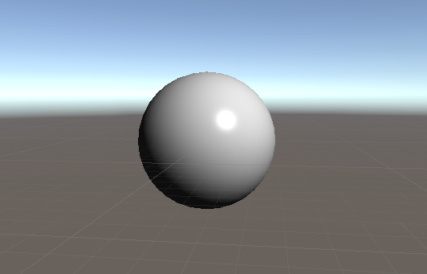

# Unity ADS Shader

Ambient + Diffuse + Specular

ブログに解説記事を載せていきます。

- [UnityでMeshをスクリプトから作る | 測度ゼロの抹茶チョコ](https://matcha-choco010.net/2018/08/25/unityでmeshをスクリプトから作る/)
- [Unityで頂点色を表示するシェーダを作る | 測度ゼロの抹茶チョコ](https://matcha-choco010.net/2018/08/29/unityで頂点色を表示するシェーダを作る/)
- [Unityのシェーダのプロパティを使ってみる | 測度ゼロの抹茶チョコ](https://matcha-choco010.net/2018/08/31/unityのシェーダのプロパティを使ってみる/)
- [Unityで頂点単位の単一平行光源による拡散反射のシェーディングを実装する | 測度ゼロの抹茶チョコ](https://matcha-choco010.net/2018/09/01/unityで頂点単位の単一平行光源による拡散反射のシェーディングを実装する/)
- [Unityで頂点単位のADSシェーディングを実装する | 測度ゼロの抹茶チョコ](https://matcha-choco010.net/2018/09/02/unityで頂点単位のadsシェーディングを実装する/)
- [Unityでフラグメント単位のADSシェーディングを実装する | 測度ゼロの抹茶チョコ](https://matcha-choco010.net/2018/09/08/unityでフラグメント単位のadsシェーディングを実装する/)
- [ADSシェーダをテクスチャ対応させる | 測度ゼロの抹茶チョコ](https://matcha-choco010.net/2018/10/08/adsシェーダをテクスチャ対応させる/)
